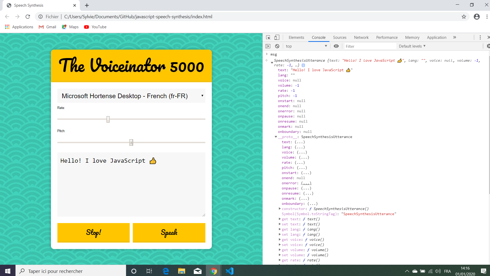

# :zap: Javascript Speach Synthesis

Wes Bos Youtube Tutorial: [JavaScript Text-To-Speech - #JavaScript30 23/30](https://www.youtube.com/watch?v=saCpKH_xdgs).
* **Note:** to open web links in a new window use: _ctrl+click on link_


## :page_facing_up: Table of contents

* [General info](#general-info)
* [Screenshots](#screenshots)
* [Technologies](#technologies)
* [Setup](#setup)
* [Features](#features)
* [Status](#status)
* [Inspiration](#inspiration)
* [Contact](#contact)

## :books: General info

* Tutorial Code using javascript speach synthesis.

## :camera: Screenshots

.

## :signal_strength: Technologies

* [Javascript ECMA-262 ECMAScript 2020](http://www.ecma-international.org/publications/standards/Ecma-262.htm)

## :floppy_disk: Setup

* Open index.html in browser. If any code is changed the browser needs to be refreshed.

## :computer: Code Examples

* show voices that can be chosen by user in a dropdown menu.

```javascript
function populateVoices() {
  voices = this.getVoices(); // array of 25 synthesised voices, including name & language
  voicesDropdown.innerHTML = voices
  .filter(voice => voice.lang.includes('en')) // limit 25 voices to just the ones in English
  .map(voice => `<option value="${voice.name}">${voice.name} (${voice.lang})</option>`)
  .join('');
}
```

## :cool: Features

*  Options to select different voices, voice speed and pitch.

## :clipboard: Status & To-Do List

* Status: Working.
* To-Do: Nothing.

## :clap: Inspiration

* Wes Bos Youtube Tutorial: [JavaScript Text-To-Speech - #JavaScript30 23/30](https://www.youtube.com/watch?v=saCpKH_xdgs).

## :file_folder: License

* N/A

## :envelope: Contact

* Repo created by [ABateman](https://github.com/AndrewJBateman), email: gomezbateman@yahoo.com
